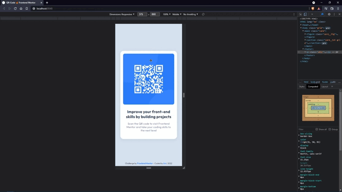
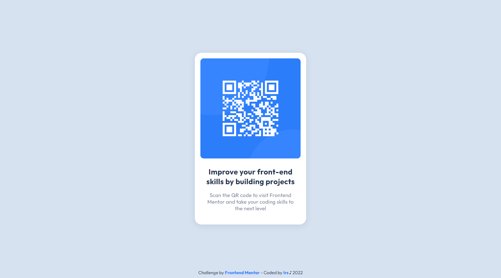

# Frontend Mentor - QR code component solution

Hi 👋

This is a solution to the [QR code component challenge on Frontend Mentor](https://www.frontendmentor.io/challenges/qr-code-component-iux_sIO_H). 

## Table of contents

  - [Screenshot](#screenshot)
  - [Link](#link)
  - [Built with](#built-with)
  - [Author](#author)

## Screenshot

- Mobile

- Desktop

## Link

- [Live](https://your-live-site-url.com) 👀

## Built with

- Mobile-first workflow
- Semantic HTML5 markup
- CSS custom properties
- CSS Grid

## Author

- Frontend Mentor - [@Irs-mp](https://www.frontendmentor.io/profile/Irs-mp)
- Twitter - [@Irs_mp](https://twitter.com/Irs_mp)
